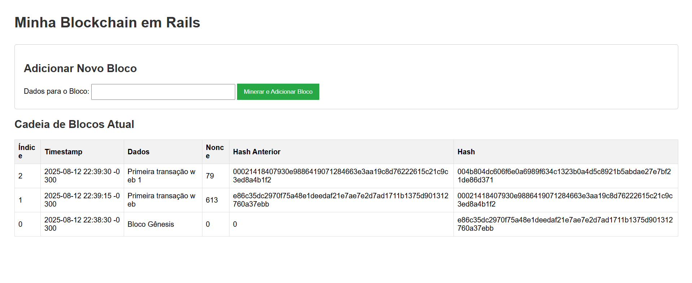

# Blockchain em Ruby on Rails (rails-chain)


Este projeto é uma implementação educacional de uma blockchain simples, construída com Ruby on Rails. O objetivo é demonstrar a compreensão e a aplicação dos conceitos fundamentais por trás da tecnologia blockchain, como blocos, cadeias criptográficas e o mecanismo de consenso de Prova de Trabalho (Proof of Work).

## Screenshot

****

---

## Sobre o Projeto

A aplicação permite visualizar uma cadeia de blocos e adicionar novos blocos a ela. Cada novo bloco deve ser "minerado" antes de ser adicionado, resolvendo um desafio de Prova de Trabalho, o que torna a cadeia segura e imutável.

### Principais Conceitos Implementados

* **Bloco (`Block`):** A estrutura de dados fundamental, contendo um índice, timestamp, dados, o hash do bloco anterior e um *nonce*.
* **Cadeia (`Blockchain`):** Uma lista encadeada de blocos, onde cada bloco está criptograficamente ligado ao anterior através de seu hash. A cadeia começa com um "Bloco Gênesis".
* **Prova de Trabalho (`Proof of Work`):** Um mecanismo de consenso que exige trabalho computacional para adicionar um novo bloco. A dificuldade é definida por um número de zeros que o hash do bloco deve ter no início. O *Nonce* é incrementado até que um hash válido seja encontrado.

A lógica principal da blockchain foi separada na pasta `app/services`, demonstrando uma organização de código que isola a lógica de negócio dos componentes MVC padrão do Rails.

## Tecnologias Utilizadas

* [Ruby](https://www.ruby-lang.org/)
* [Ruby on Rails](https://rubyonrails.org/)
* HTML / CSS Básico

## Funcionalidades

* Visualização da cadeia de blocos em tempo real (em memória).
* Interface web para adicionar novos dados à blockchain.
* Mineração de novos blocos com um nível de dificuldade ajustável.
* Validação implícita da cadeia através da ligação por hash.

## Como Executar o Projeto Localmente

Siga os passos abaixo para rodar a aplicação no seu ambiente de desenvolvimento.

### Pré-requisitos

* Ruby (versão ~3.3.x)
* Ruby on Rails (versão ~7.1.x)
* Bundler
* Node.js

### Passos para Instalação

1.  **Clone o repositório:**
    ```bash
    git clone [https://github.com/SEU-USUARIO/rails-chain.git](https://github.com/SEU-USUARIO/rails-chain.git)
    ```

2.  **Navegue até o diretório do projeto:**
    ```bash
    cd rails-chain
    ```

3.  **Instale as dependências (gems):**
    ```bash
    bundle install
    ```

4.  **Inicie o servidor Rails:**
    ```bash
    rails server
    ```

5.  **Acesse a aplicação:**
    Abra seu navegador e visite `http://localhost:3000`.

## Próximos Passos e Melhorias Futuras

Este projeto é uma base sólida. As próximas melhorias para torná-lo uma aplicação mais robusta incluem:

-   [ ] **Persistência de Dados:** Salvar a blockchain em um banco de dados (como PostgreSQL) em vez de mantê-la apenas em memória.
-   [ ] **API Endpoints:** Criar uma API RESTful para que outras aplicações possam interagir com a blockchain (ver a cadeia, submeter transações).
-   [ ] **Sistema de Transações:** Implementar um modelo de "Transações" mais complexo em vez de apenas uma string de dados.
-   [ ] **Rede P2P:** Adicionar uma camada de rede para que múltiplas instâncias da aplicação possam se comunicar e sincronizar suas cadeias, simulando uma rede descentralizada.
-   [ ] **Validação da Cadeia:** Criar um método para percorrer a cadeia e validar se todos os hashes e provas de trabalho estão corretos.

## Autor

**[Marcos Nobre Castro Silva]**

* GitHub: `https://github.com/marcosnobre26`
* LinkedIn: `https://linkedin.com/in/marcos-nobre-1363661a8`
